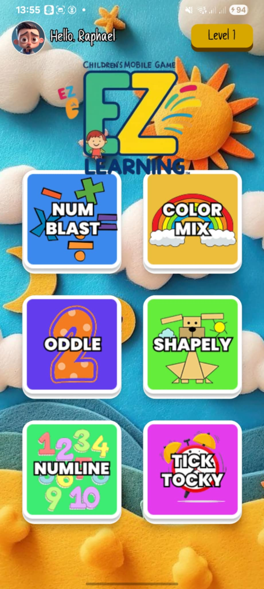
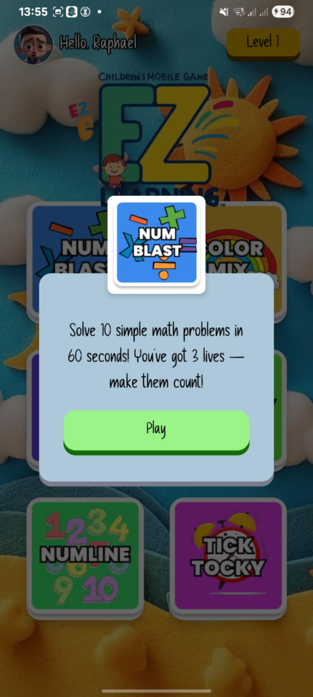
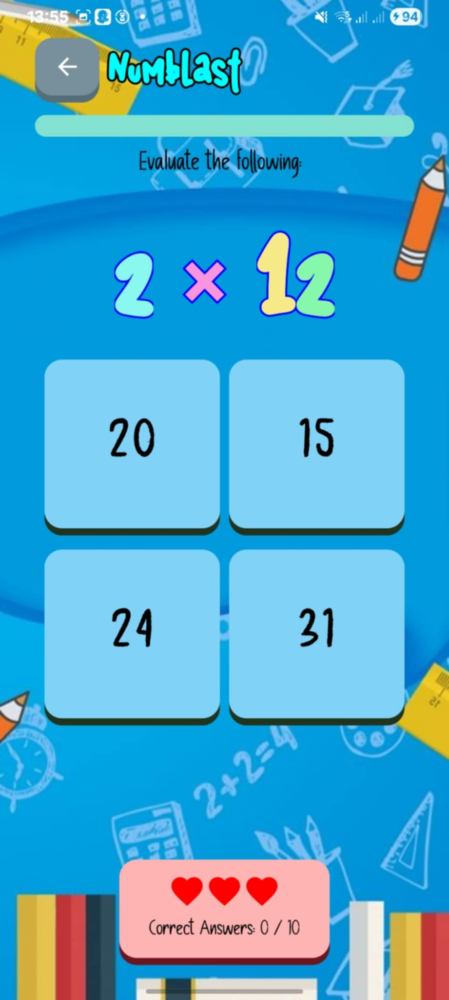

# EZLearn - Interactive Learning App for Kids

## 💡 About the Project

EZLearn is an Android app that helps kids learn in a fun and interactive way. It has simple games and activities like mixing colors, knowing shapes, and sorting numbers. The app uses bright colors and a kid-friendly design made with Jetpack Compose. EZLearn makes learning easy and fun for young children.

  
  
  

### **⚙ Tools and Technologies Used**

1. **Kotlin** - Core programming language for the app.
2. **Jetpack Compose** - Modern toolkit for building native Android UIs.
3. **AndroidX Room** - For navigation, data storage, and lifecycle management.
4. **Material3** - For consistent and modern UI components.

## ❗❗ Disclaimer

This project was made as part of the final requirement for Application Development class at Pamantasan ng Lungsod ng Maynila. It is for learning purposes only and not meant for real-world or production use. This was a one-time submission and may not update or maintain this project regularly.

## 👥 Developers

<b>20242 BSCS 2-3

<b>LEADER: MANGUNI, John

-   CATACUTAN, Raphael
-   FRIAS, Railey
-   ROBANTE, Floyd
